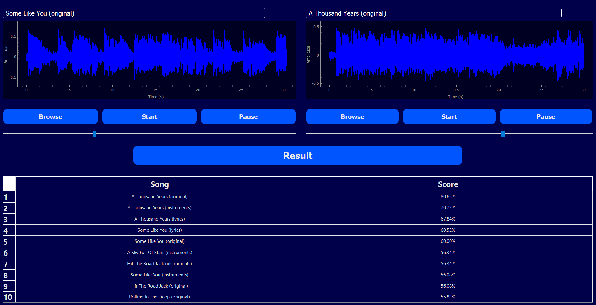

# Signal Fingerprint



## Description

- Desktop Application Designed For Identifying Music By Analyzing Its Unique Intrinsic Features
- This Application Mimics The Functionality Of Shazam
- Allows Identifying Audio Composed Of 2 Different Songs

## Tech Stack Used

|**Functionality** | |
|--- | --- |
|**UI** | |
|**Styling** | [](#)|

## Demo

https://github.com/user-attachments/assets/d4f41313-98ee-4964-8df0-78ed5dac24ad

## How It Works
- Split Each Song In Our Dataset Into 3 Audio Files, Consisting Of Original Song, Instruments Only, Vocals Only
- Generate Spectrogram For Each Audio File In Our Dataset `data` directory
- Extract Specific Features From The Spectrogram
- Normalize & Specular Hash Each Feature
- Save The Hashed Features Of Each Audio File
- Run The Application And Browse Any Song
- Compare The Hashed Features Of the Browsed Song With Our Hashed Dataset `hashed` directory


## Installation

1. Make Sure That Pip & Python Are Installed On Your System

2. Clone The Repo Onto Your Local System or Download The Zip File & Extract It
   ```bash
    git clone https://github.com/mostafa-aboelmagd/signal-fingerprint.git
    ```

3. Nagivate To The Project's Directory 
   
4. Install The Required Libraries
    ```bash
    pip install -r requirements.txt
    ```

5. Run `main.py` File
    ```bash
    python MainWindow.py
    ```

## Contributors

| Name | GitHub | LinkedIn |
| ---- | ------ | -------- |
| Mostafa Ayman | [](https://github.com/mostafa-aboelmagd) | [](https://www.linkedin.com/in/mostafa--aboelmagd/) |
| Ali Zayan | [](https://github.com/alizayan684) | [](https://www.linkedin.com/in/%D8%B9%D9%84%D9%8A-%D8%B2%D9%8A%D8%A7%D9%86-%F0%9F%94%BB%F0%9F%87%B5%F0%9F%87%B8-b98239264/) |
| Zeyad Amr | [](https://github.com/Zisco2002)| [](https://www.linkedin.com/in/zeyad-amr-3506b225b/) |
| Mostafa Mousa | [](https://github.com/MostafaMousaaa) | [](https://www.linkedin.com/in/mostafa-mousa-b81b8322a/) |
| Omar Khaled | [](#)| [](https://www.linkedin.com/in/omar-khaled-064b7930a/) |
